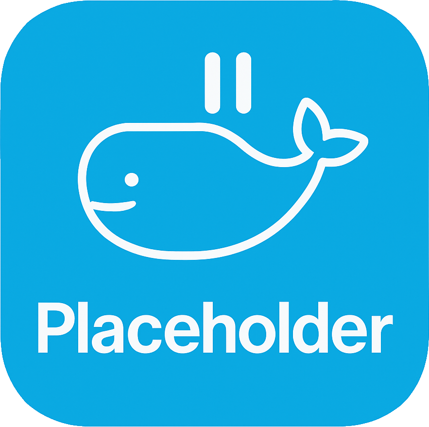

<p align="center">
  
</p>
<p align="center">
  <strong>Minimal Docker container that runs indefinitely with minimal resources.</strong>
</p>
<p align="center">
  <a href="https://badgetrack.pianonic.ch/badge?tag=docker-placeholder&label=visits&color=5ea8dd&style=flat"></a>
  <a href="https://github.com/pianonic/docker-placeholder/blob/main/LICENSE"></a>
  <a href="https://github.com/pianonic/docker-placeholder/releases"></a>
  <a href="https://github.com/pianonic/docker-placeholder?tab=readme-ov-file#-quick-start"></a>
</p>

---

## 🚀 Quick Start

```bash
# Pull from Docker Hub
docker pull pianonic/docker-placeholder

# Or from GitHub Container Registry
docker pull ghcr.io/pianonic/docker-placeholder

# Run the container
docker run -d --name placeholder pianonic/docker-placeholder
```

## 🛠️ Build Locally

```dockerfile
FROM alpine:latest
CMD ["sleep", "infinity"]
```

```bash
docker build -t docker-placeholder .
docker run -d --name docker-placeholder docker-placeholder
```

## 🎯 Use Cases

- 🧪 **Testing**: Container orchestration testing
- 🔧 **Development**: Temporary placeholder containers  
- 📊 **K8s/Swarm**: Maintain container counts
- 📚 **Learning**: Simple Docker example
- 🛡️ **Traefik Middleware**: Use as a dummy backend for testing Traefik middleware configurations (e.g., authentication, rate limiting, headers, etc.)

---

##  License

MIT License - See [LICENSE](LICENSE) for details.

---

<p align="center">Made with ❤️ by PianoNic</p>
